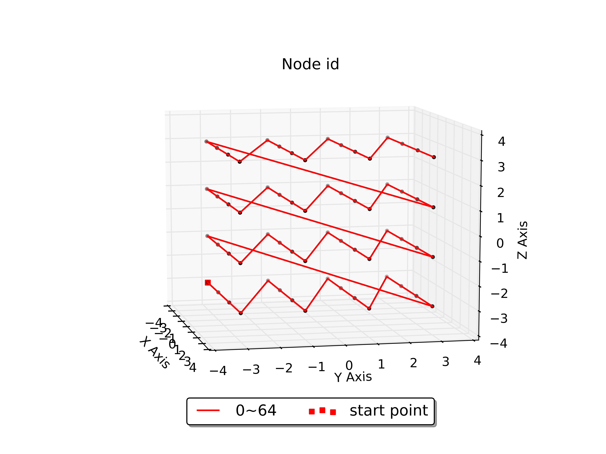

# Simple mesh
Generate simple mesh used for [CB-Geo MPM](https://github.com/cb-geo/mpm)

Current support:
* 3D MPM mesh (E3DH8)
* 3D GIMP mesh (E3DH64G)

2D mesh is under construction.

## Node index
The numbering of created node follow:
* xmin -> xmax
* ymin -> ymax
* zmin -> zmax



## Element node order
### MPM (ED3H8)

```
    # Hexahedron:             Hexahedron20:          Hexahedron27:
    #        v
    # 3----------2            3----13----2           3----13----2
    # |\     ^   |\           |\         |\          |\         |\
    # | \    |   | \          | 15       | 14        |15    24  | 14
    # |  \   |   |  \         9  \       11 \        9  \ 20    11 \
    # |   7------+---6        |   7----19+---6       |   7----19+---6
    # |   |  +-- |-- | -> u   |   |      |   |       |22 |  26  | 23|
    # 0---+---\--1   |        0---+-8----1   |       0---+-8----1   |
    #  \  |    \  \  |         \  17      \  18       \ 17    25 \  18
    #   \ |     \  \ |         10 |        12|        10 |  21    12|
    #    \|      w  \|           \|         \|          \|         \|
    #     4----------5            4----16----5           4----16----5
```

### GIMP (ED3H64G)


## Usage 
Just run mesh.py

For gimp mesh, we can also use the code (gimp_mesh) written by Christopher Wilkes, Cambridge University. 
> Note: gimp_mesh follow different node index scheme
